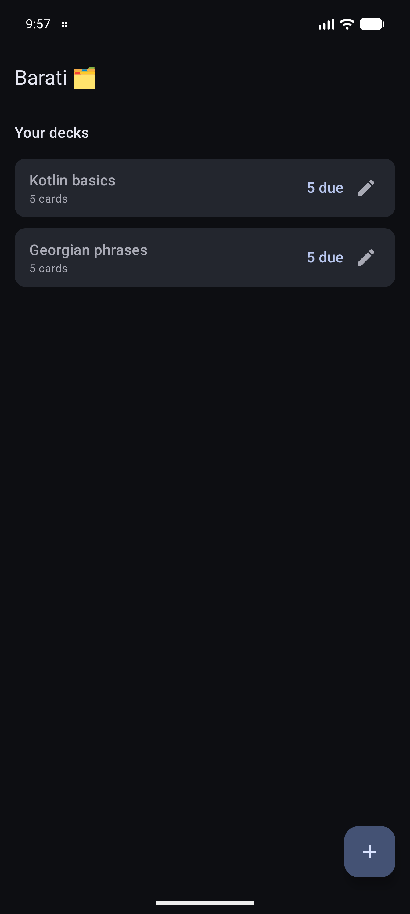
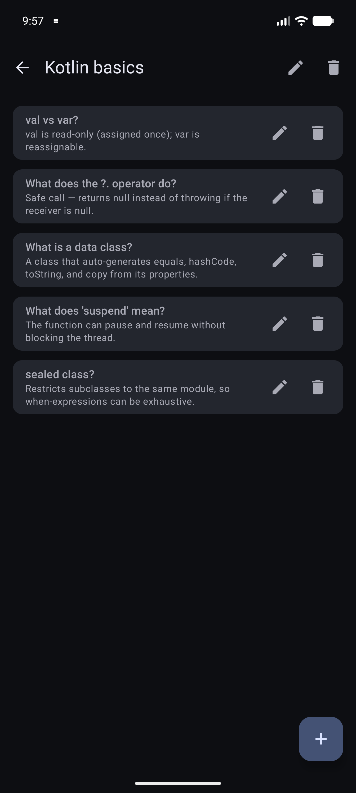
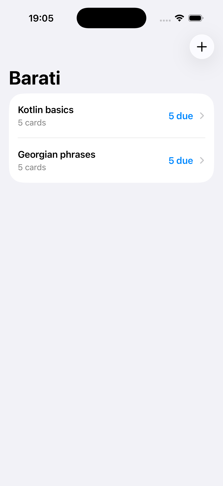
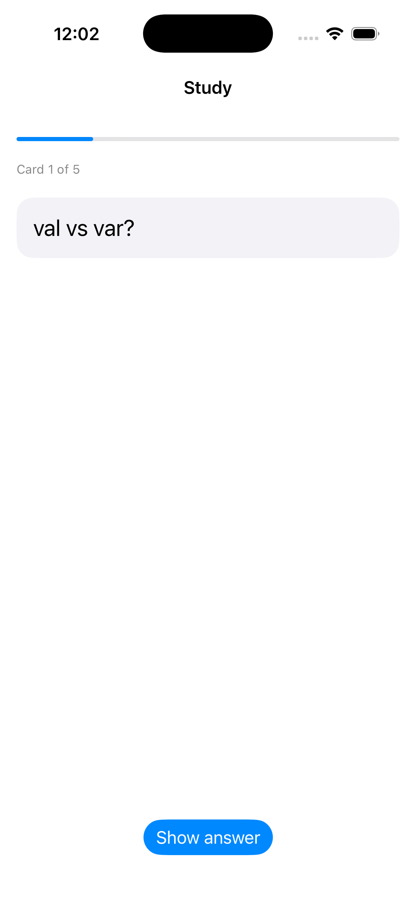

# Barati 🗂️

[](https://github.com/Meko123456/Barati/actions/workflows/ci.yml)
[](LICENSE)

**ბარათი** (*barati* — Georgian for "card") — a spaced-repetition flashcards app
built with **Kotlin Multiplatform Mobile (KMM)**.

The interesting part is the architecture. Rather than sharing UI, Barati shares
only the **business logic in Kotlin** and keeps each platform's UI **fully
native** — Jetpack Compose on Android, SwiftUI on iOS.

## Features

- 🧠 **SM-2 spaced repetition** — the scheduling algorithm lives in shared
  Kotlin and is unit-tested once; both apps grade cards (Again / Hard / Good /
  Easy) and only surface what's due.
- 🗂️ **Decks & cards you own** — create, rename and delete decks; add, edit and
  delete cards. Two bundled starter decks seed on first launch.
- 💾 **Native persistence** — review progress and your decks survive restarts,
  stored via `SharedPreferences` on Android and `UserDefaults` on iOS; the
  serialization and scheduling stay in shared Kotlin.
- 🤖🍎 **Genuinely native UI** — the same shared repository drives a Compose UI
  and a SwiftUI UI, each idiomatic to its platform.

## Screenshots

| Android — decks | Android — edit a deck |
|---|---|
|  |  |

| iOS — decks | iOS — study |
|---|---|
|  |  |

## Architecture

```
shared/      Kotlin Multiplatform module — domain (SM-2, decks), persistence, sample data
androidApp/  Android app — Jetpack Compose over the shared module
iosApp/      iOS app — SwiftUI, links the shared framework (xcodegen project)
```

Only the storage backend is platform-specific (a small `KeyValueStore` with
`SharedPreferences` / `NSUserDefaults` implementations). Models, JSON
serialization, the SM-2 engine, scheduling and the deck repository are shared.

## Why native UI over shared UI?

Shared UI (Compose Multiplatform) is great, but native UI proves you can deliver
the look-and-feel each platform expects — SwiftUI navigation, gestures and
system integration on iOS; Material 3 on Android — while still sharing the hard
part (domain logic, persistence, algorithms) exactly once.

## Build & run

**Android**

```bash
./gradlew :androidApp:installDebug        # build + install on a running device/emulator
./gradlew :shared:allTests                # run the shared unit tests (JVM + iOS + Android host)
```

**iOS** (macOS)

```bash
cd iosApp
xcodegen generate                          # generate Barati.xcodeproj
open Barati.xcodeproj                       # then run on a simulator from Xcode
```

The shared Kotlin framework is built automatically as an Xcode pre-build step.

## License

[MIT](LICENSE)
